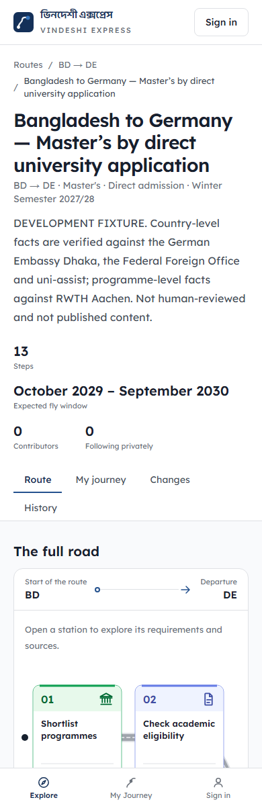

# ভিনদেশী এক্সপ্রেস · Vindeshi Express

**Studying abroad becomes far easier when you can see the whole road before you take the first
step. That is what this builds.**

A student in Dhaka who wants to do a Master's in Germany has to solve about forty problems in a
particular order. Which documents, authenticated by whom. Whether the degree is recognised, and
who decides that. Which English test, taken where in Bangladesh, valid for how long. What counts
as proof of funds. Which embassy has jurisdiction, and how far ahead the appointment has to be
booked. Almost none of it is written down in one place, and the part that is written down goes
out of date quietly.

Vindeshi Express puts one such path on screen as a road, with every stage in order, and lets the
people who have already walked it keep the road accurate for the people behind them.

---

## How it works

Search `origin → destination → study level → intake`. Each way of getting there comes back as a
**ribbon**: the route compressed into a single band you can compare at a glance.

Open a ribbon and it unfolds into a **road**, the same route at full size, with every **step** in
sequence: documents, tests, admission, funding, visa, departure. Open a step and you get its
**fields**, which are the smallest thing anyone maintains. A field is one requirement, one
procedure, one contact, one address, one cost, one deadline, or one person's experience. Each
carries its own source, its own last-confirmed date, and its own history.

Sign in and you can **follow** a route. That gives you a private journey: the live public route,
plus your own progress, your own target dates, your own notes. Nobody else can see any of it. If
the public route changes while you are partway along it, you are shown what changed, where, and
whether it lands ahead of you or behind you.

Anyone signed in can improve a route. Four actions, deliberately small: **add**, **update**,
**confirm** that something is still true, or **challenge** something that is not. Every one of
them writes a revision and keeps the previous value.

---

## What it looks like

Every route below is **research content on a disposable database, not published content**. These
are five real Bangladesh-origin Master's routes (Malaysia, the UK, Japan, Germany, Austria),
written from official sources to exercise the software against the kind of content it is actually
for. The production database holds zero routes and always has; see *Where the project stands*.

### The landing page

Nothing here needs an account. Search, routes, steps, sources and safety signals are all readable
signed out; signing in only unlocks contributing and private tracking.


### The road

A route is a graph, not a list, so it draws as one. Germany runs eighteen stages, wraps across
five rows, marks the stages that genuinely happen in parallel, and forks three ways where a
student chooses between applying direct, through uni-assist, or via a VPD. Stage 14 is a
twenty-seven-month wait for a consular appointment. That is the kind of fact that decides whether
a route is viable at all, and exactly what is hard to find written down.

To the right is the route's standing, stated plainly: experimental, nobody has confirmed anything,
no named contributors, and a note that an absence of warnings is not evidence of anything.

![A route page titled "Study a Master's in Germany from Bangladesh". A header strip reads 18 steps, expected fly window September 2029 to July 2030, 0 contributors, 0 following privately. Tabs for Route, My journey, Changes and History. Below, a road of eighteen numbered coloured stages wrapping across five rows, with sections marked "Parallel work" and three branches marked "Choose one pathway". Beside it a panel headed "Read this route with care" lists three cautions, and a step index lists all eighteen stages with their categories and durations](docs/screenshots/route-road.png)

### A ribbon

The ribbon is not a card and not a thumbnail. It is the same route, compressed: the same eighteen
stages in the same order, with the same branches, small enough to compare several at once. Count
the chevrons against the road above and they match, because both come from one layout pass over
the same graph.


### A field, and where it came from

This is the part most of the design effort went into, and this one step shows why. Opening *Wait
for appointment eligibility* keeps the whole road on screen and unfolds the step underneath it.

Inside, the information is grouped by **who is making the claim**, and the grouping is the point:
an official rule and somebody's experience can never merge into one field or overwrite each other.
The Embassy's own warning that the queue exceeds 27 months sits under *From official and
institutional sources*, with its source and the date it was checked. The report that applicants
are confused about the transition sits under *From the community*, marked as not corroborated by
anyone else. Both are useful. They are not the same kind of thing, and the page never lets them
look like one.

![A route page with the step "Wait for appointment eligibility" opened beneath the road. Under a heading "From official and institutional sources" are two entries: a duration warning that the queue currently exceeds 27 months, and a dependency warning from the German Embassy Dhaka, each carrying its source, an applicability chip and a checked date. Under a separate heading "From the community" is a community experience about applicant confusion, marked "Community submission, not corroborated by anyone else"](docs/screenshots/step-fields.png)

### How much of the record exists

A community-maintained record should say how much community there is. Counted exactly from the
routes themselves and never rounded up. It decides nothing: no count here feeds ranking,
standing, or how much to trust a route.

Note what it is honest about. These five routes were loaded by a script rather than written by
people, so *people have contributed* reads **0** while *corrections recorded* reads 180. That is
the truth, and a number that flattered the platform here would tell you how to read every other
number on the site.


### On a phone

Most students arrive on a phone browser, so the phone gets its own information architecture
rather than a squeezed copy of the desktop one: bottom tab navigation, and a road recomposed into
two columns instead of five.



---

## Where the project stands

The application is built and tested end to end. Search, ribbons, roads, steps, fields, private
journeys, the contribution loop, change propagation, shadow comparison, reporting and quarantine
all work.

What does not exist yet is route content. The production database holds zero routes and always
has, because of a rule the whole project rests on:

> A fabricated route is worse than an empty platform. A reader cannot tell an invented route from
> a researched one, and the moment that difference stops being visible, nothing else here is
> worth anything.

So the seed content is researched by hand before launch, and until then the only routes that
exist live on a disposable database, label themselves as fixtures, and are removed by resetting
that database rather than by any delete path in the product. There is no admin delete button, and
that was a decision rather than an omission.

---

## What it refuses to be

- **Not an agency or a consultancy.** It submits nothing on anyone's behalf and takes no fee.
- **Not a document vault.** It never collects passports, transcripts, test certificates, bank
  statements, visa documents or admission letters. There is no upload endpoint anywhere in it, so
  there is nothing to leak.
- **Not a verifier.** It never verifies a user's claimed progress and never claims to have
  verified a route. It shows sources, dates and who said what, and lets you judge.
- **Not for sale.** No sponsorship, advertisement or payment can move a route up the results,
  raise its standing, change how a source is classified, or affect a moderation decision.
- **Not a scholarship finder, a ranking site, a social feed, or a booking service.**
- **Not built on AI.** The dependency list is six packages long and none of them is a model.

It also stores very little, says exactly what, and lets you leave. The privacy and terms pages
in the application are written from what the code actually does, and a test re-checks each claim against the
source on every commit. No OAuth tokens are kept, the email never reaches your session, there is
no name or photo column, and there is no upload path anywhere.

Closing your account erases your email, the link to your Google account, every session, and every
followed route with all of its progress, dates and notes. Your contributions stay, signed with a
handle that was generated and is not your name, because taking authorship out of a public record
other people depend on would damage the record without protecting you.

---

## The rules the code actually obeys

Every row below is enforced by something other than good intentions: a test, an ESLint boundary,
a Prisma client extension, or a Postgres trigger.

| Rule | How it is held |
|---|---|
| Shared knowledge is never destroyed | No delete path exists for routes, steps or fields for any normal user. Obsolete content is challenged and archived. Postgres triggers refuse `DELETE` even from psql. |
| Every edit keeps the old value | All revisioned writes go through one service. A raw `prisma.field.update()` anywhere else is refused at runtime and blocked at lint time. |
| Nobody owns a route | There is no owner check on any edit. The person who created a route has no rights over it that you do not have. |
| Private progress stays private | Journey queries take the session user id as a required argument, so a query that forgets to scope itself does not compile. |
| Progress never requires proof | Marking a step complete asks for nothing. There is no upload path to ask with. |
| An official rule and someone's experience never merge | They are different claim types, cannot overwrite one another, and are grouped separately on screen. |
| Silence is not safety | Nothing derives a safe or verified badge from an absence of reports. |
| Counts decide nothing on their own | Follower numbers, votes and report volume never automatically archive, rank, promote or trust anything. |
| Estimates are labelled as estimates | An expected departure window is a planning aid and is worded as one, never as a date you will fly. |
| The renderer knows nothing about routes | No country, destination or route may need bespoke artwork or special-cased code. Proved by a test: two routes with identical structure and different destinations must lay out to identical geometry, label text aside. |

---

## Built with

Next.js 15 and React 19 on the App Router, TypeScript in strict mode, Prisma against Neon
serverless Postgres, Auth.js for Google sign-in, Tailwind for styling, Vitest and Playwright for
tests, deployed on Vercel.

The route visuals are a data-driven SVG renderer built from hand-authored primitives, with no
chart library. A road segment, a junction, a step marker, a branch and a shadow segment are drawn
once each; every route in existence is assembled from those.

**The read path works with JavaScript switched off.** That is not a boast, it is the requirement:
a student in Dhaka on a slow connection is the person this is for. Search, ribbons, roads, steps,
fields, sources and history all render on the server and need no script to be read.

Three client components exist, and the list is asserted by a test so that a fourth is a decision
rather than a drift: the two error boundaries, which Next requires to be client components and
which ship only after something has already failed, and a pointer glow that renders nothing on
the server, nothing on first paint, and that nothing depends on.

The same rule is why there is no analytics, no tracking and no error-reporting SDK. Server errors
are logged through Next's own `onRequestError` hook as structured JSON, so the digest a reader is
shown is the digest in the log, and nothing is sent to anybody.

---

## Running it

```bash
npm install
cp .env.example .env.local     # fill in DATABASE_URL, AUTH_SECRET and the Google client
npm run db:deploy              # apply migrations
npm run dev                    # http://localhost:3000
```

```bash
npm run lint                   # eslint, including the database import boundary
npm run typecheck              # tsc --noEmit
npm run test                   # vitest: unit, architecture and invariant tests
npm run test:e2e               # playwright
npm run build                  # production build

npm run db:status              # is the linked branch up to date with prisma/migrations?
npm run db:objects             # tables, enum types and row counts
npm run db:studio              # inspect data

npm run admin:list             # who holds the safety role
npm run admin:grant -- --handle <handle>
npm run admin:revoke -- --handle <handle>
```

The safety role is granted from a workstation rather than from a page in the product. It gates
quarantine and report handling and nothing else. Ordinary contribution is outside its reach, and
no role can delete shared knowledge. A page that could grant it would be a page that can grant it
to anybody, for ever, reachable by whoever holds it that year.

One warning worth reading before you run anything that writes. Test writes are refused unless the
target database positively identifies itself as disposable, and the check fails closed: an
unreachable database counts as unknown, and unknown is not permission. Shared route knowledge is
deliberately undeletable, so a mistaken seed against production is not something an apology
undoes.

---

## Reading the repository

The written record is part of the project and is meant to be read, not skimmed:

| File | What is in it |
|---|---|
| [`CLAUDE.md`](CLAUDE.md) | The rules: vocabulary, the invariants listed above, conventions, and the argument behind each one |
| [`REQUIREMENTS.md`](REQUIREMENTS.md) | The frozen baseline: 81 functional requirements, 35 business rules, 47 recorded decisions |
| [`Phases.md`](Phases.md) | The plan, phase by phase, with exit criteria and the four pre-launch gates |
| [`Status.md`](Status.md) | A session log: what was done, what was decided, what is blocked |
| [`Test.md`](Test.md) | The test ledger, including the defects that no test caught and why |
| [`Visual References/`](Visual%20References/) | The mockups that define design intent |

Every behaviour traces to a requirement id. Every deliberate departure from a mockup is written
down together with the rule that forced it, because an unexplained difference is a defect and an
explained one is a decision.

---

## Licence

Licensed under the [GNU Affero General Public License v3.0](LICENSE) or later.

The AGPL is the right fit for a public good. You may use, study, change and share this freely.
If you run a modified version as a service that other people can reach, you have to publish your
changes too. In other words, this can be forked and improved by anybody, and it cannot be quietly
turned into a closed commercial study-abroad product.

Copyright © 2026 the Vindeshi Express contributors.

---

## Supporting it

The platform is free and stays free. No paid features, no premium routes, no paid rankings.

There is one voluntary support link in the footer and it is the only monetisation of any kind.
It changes nothing at all: the platform never sees a payment, and a supporter is indistinguishable
from a non-supporter to the system. Not by policy, but by construction, because no supporter flag
exists for anything to read.

<div align="center">
<br>
<sub><b>Every step before you fly.</b></sub>
</div>
