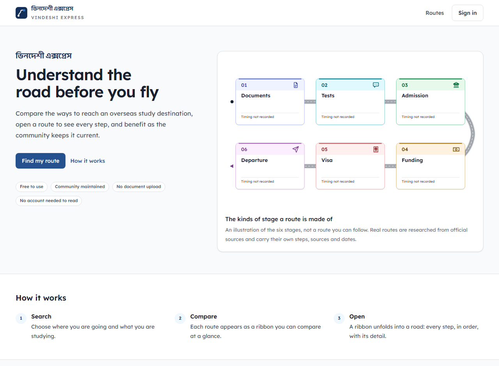
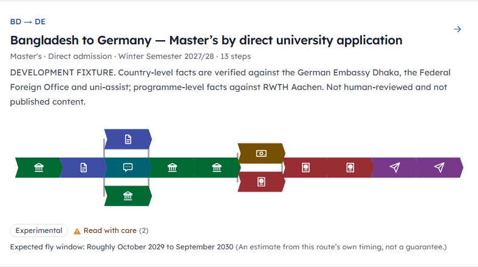
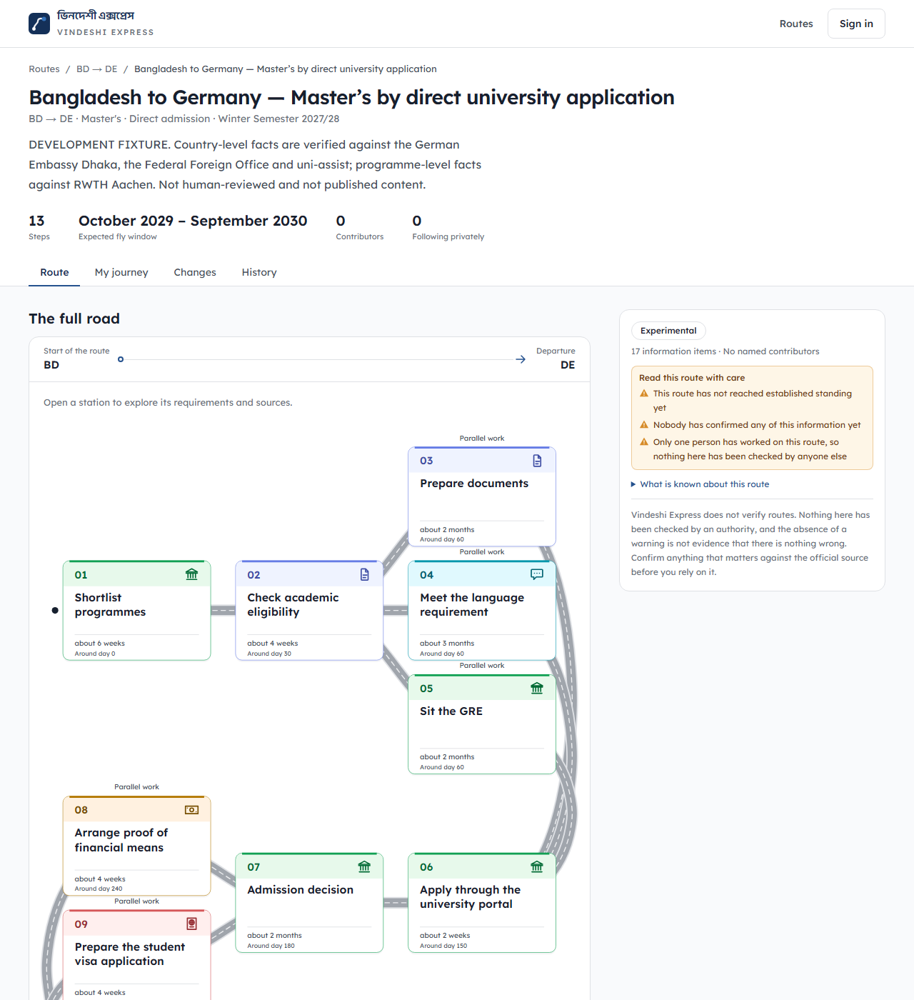
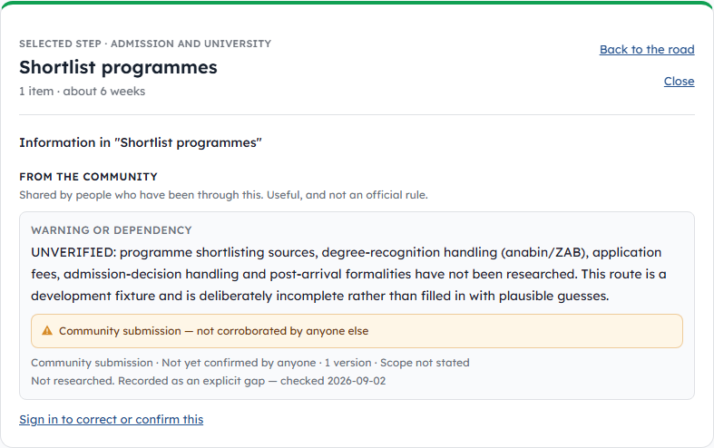

<div align="center">

# ভিনদেশী এক্সপ্রেস · Vindeshi Express

**Understand the road before you fly.**

A Bangladesh-first, community-maintained navigation and tracking platform for students
pursuing higher education abroad. A public good, not a business.

</div>

---

## What it is

Compare the available ways to reach an overseas study destination, open a route to understand
every step, privately follow it as your own journey, and benefit continuously as the community
corrects and updates the public route.

The idea in one sentence: **people ahead on the journey leave the route clearer for the people
coming behind them.**

A visitor searches `origin → destination → study level → intake`. Results appear as compact
visual **ribbons**. Opening a ribbon unfolds it into a **road** of ordered **steps** — documents,
IELTS, admission, funding, visa, departure. Each step expands into **fields**: a requirement, a
procedure, a contact, an address, a cost, a deadline, somebody's experience, a warning. A
signed-in user can **follow** a route as a private **journey**, mark progress, and see when the
live public route changes underneath them.

---

## Project status

**Pre-launch. The engineering is essentially complete; the route content is not written yet.**

The application is built and tested — search, ribbons, roads, steps, fields, private journeys,
the contribution loop, change propagation, shadow comparison, reporting and quarantine all work
end to end. What does not exist yet is *real route content*, which the project owner researches
and supplies before launch.

That gap is deliberate, and it is the most important thing to understand about this repository:

> **A fabricated route is worse than an empty platform.** A reader cannot tell an invented route
> from a researched one, and the whole product rests on that difference staying visible.

So the production database holds **zero routes**, and always has. Every route you see in the
screenshots below is a **development fixture** on a disposable database — it exists to exercise
the mechanism, it says so on its own face, and it is deleted by resetting that database rather
than by any delete path in the product.

---

## What it looks like

> **Every route in these screenshots is a development fixture, not published content.** Its
> durations, dates and requirements are for exercising the software. The product labels them as
> such on screen, which is why you can see it doing so below.

### The landing page

Minimal by intent. Complexity appears only after the visitor acts, and nothing here needs an
account — search, routes, steps, sources and safety signals are all readable signed out.



### A ribbon

A ribbon is **not a card and not a preview — it is the route, compressed.** The same stages, in
the same order, at a density you can compare across search results at a glance. It carries the
route's shape, including where it branches.



### The road

Opening a ribbon unfolds it into the same object at full density. The road wraps across rows,
carries every stage in order with its category and timing, and shows what the route's standing
actually is — here, an experimental route nobody has confirmed yet.



### A step, and where its information came from

The smallest maintained unit is a **field**, and every field states what kind of claim it is,
who asserts it and when it was last confirmed. Note what this one says: the information has *not*
been researched, and the product says so rather than filling the gap with something plausible.



### On a phone

A phone gets a different information architecture, not a narrower desktop one: bottom tab
navigation, a road recomposed into two columns rather than shrunk, and the same complete route.


---

## What this project is **not**

Stated as plainly as what it is, because each of these has been considered and ruled out:

- Not a scholarship finder or university ranking site
- Not an education agency, consultancy, or application service
- **Not a document vault.** It never collects passports, transcripts, test certificates, bank
  statements, visa documents or admission letters. There is no file upload anywhere in it.
- Not a verification authority. It never verifies a user's claimed progress, and it never claims
  to have verified a route.
- Not a social feed, a follower culture, or a messaging network
- Not a paid-placement marketplace. **Trust cannot be bought here** — no sponsorship, ad or
  payment can influence a route's order, standing, source classification or badges.
- Not flight or accommodation booking, loans, jobs, or travel sales
- Not AI-dependent. AI is not a feature of it.

---

## The rules the code actually obeys

These are enforced by tests, lint rules, a database client extension and Postgres triggers —
not by good intentions:

| Rule | What it means in the code |
|---|---|
| **Knowledge is never destroyed** | No delete path for routes, steps or fields exists for any normal user. Obsolete content is challenged and archived, never erased. Postgres triggers refuse `DELETE` outright. |
| **Every update writes a revision** | Changing a field creates a new revision preserving the prior value, its author and its timestamp. There is exactly one door into shared knowledge, and everything else is refused. |
| **Nobody owns a route** | Route creators get no special rights over what they created. Anyone signed in may correct anything. |
| **Private progress stays private** | A user's journey, dates and notes are visible to nobody else, ever. Journey queries cannot be constructed without a user id. |
| **No evidence, ever** | Marking your own progress never requires proof of anything. There is no upload endpoint to require it with. |
| **Uncertainty stays visible** | An official requirement and somebody's experience are different claim types and can never overwrite each other. A contested field renders as contested. |
| **No reports ≠ safe** | Nothing derives a safety badge from an absence of complaints. |
| **Counts decide nothing** | Follower numbers, vote totals and report volume never automatically confer or remove standing. |
| **Estimates say they are estimates** | An expected departure window is a planning aid, and is worded as one. |
| **The renderer knows nothing about routes** | No country, destination or route may require bespoke artwork or special-cased code. A route created by a contributor at 2am draws correctly with no developer involved. |

---

## Built with

| Layer | Choice |
|---|---|
| Framework | Next.js 15 (App Router), React 19, TypeScript strict |
| Database | Neon serverless PostgreSQL 18 |
| ORM | Prisma |
| Auth | Auth.js (NextAuth), Google sign-in |
| Styling | Tailwind CSS |
| Route visuals | A data-driven SVG renderer built from hand-authored primitives — no chart library |
| Testing | Vitest (unit, architecture, integration) + Playwright (end to end) |
| Hosting | Vercel |

The read path ships **one client component** and works with JavaScript disabled — a student in
Dhaka on a slow connection is the person this is built for.

---

## Running it locally

```bash
npm install
cp .env.example .env.local     # then fill in DATABASE_URL and the auth secrets
npm run db:deploy              # apply migrations
npm run dev                    # http://localhost:3000
```

Common commands:

```bash
npm run lint                   # eslint
npm run typecheck              # tsc --noEmit
npm run test                   # vitest — unit and architecture tests
npm run test:e2e               # playwright
npm run build                  # production build

npm run db:status              # is the linked branch up to date with prisma/migrations?
npm run db:objects             # tables, enum types and row counts
npm run db:studio              # inspect data
```

> **Never point a seed or a test at a production database.** Test writes are refused unless the
> target database positively identifies itself as disposable, and the guard fails closed — an
> unreachable database is "unknown", and unknown is not permission.

---

## How this repository is organised

The working documents are as much a part of the project as the code, and they are meant to be
read:

| File | What it holds |
|---|---|
| [`CLAUDE.md`](CLAUDE.md) | The project's rules: vocabulary, invariants, conventions, and the reasoning behind each |
| [`REQUIREMENTS.md`](REQUIREMENTS.md) | The frozen requirements baseline — 81 functional requirements, 35 business rules, 47 decisions |
| [`Phases.md`](Phases.md) | The development plan, phase by phase, with exit criteria and the pre-launch gates |
| [`Status.md`](Status.md) | An append-only session log: what was done, what was decided, what is blocked |
| [`Test.md`](Test.md) | The test ledger — what is tested, what is not, and the defects worth remembering |
| [`Visual References/`](Visual%20References/) | The UI mockups that define design intent |

Every behaviour is traceable to a requirement id, and every deliberate departure from a mockup
is written down with the rule that forced it. An unexplained difference is treated as a defect;
an explained one is a decision.

---

## Supporting it

The platform is free and will stay free. There are no paid features, no premium routes and no
paid rankings.

There is one voluntary support link in the footer, and it is the only monetisation of any kind.
It changes nothing: the platform never sees a payment, and supporters are **indistinguishable
from non-supporters to the system** — not by policy, but because no supporter flag exists to
condition anything on. Route order, standing, source classification and moderation cannot be
influenced by it, since there is nothing for them to read.

---

<div align="center">
<sub>Every step before you fly.</sub>
</div>
